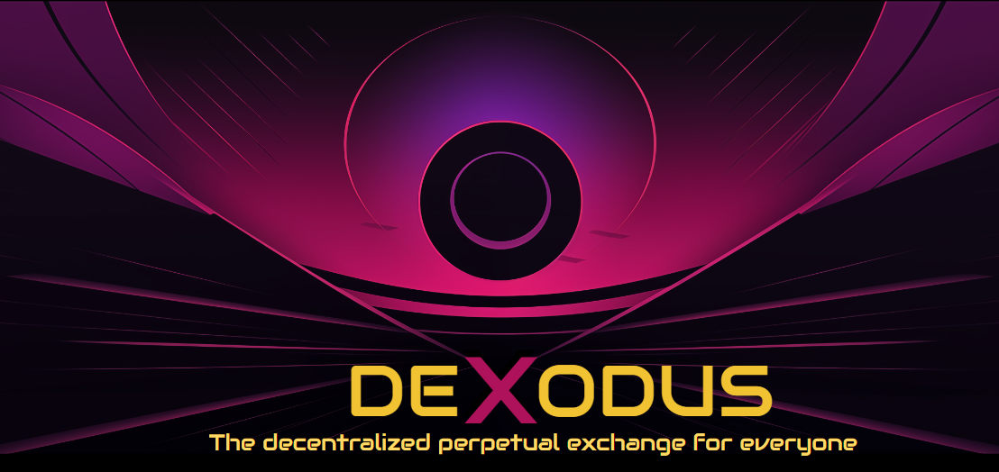
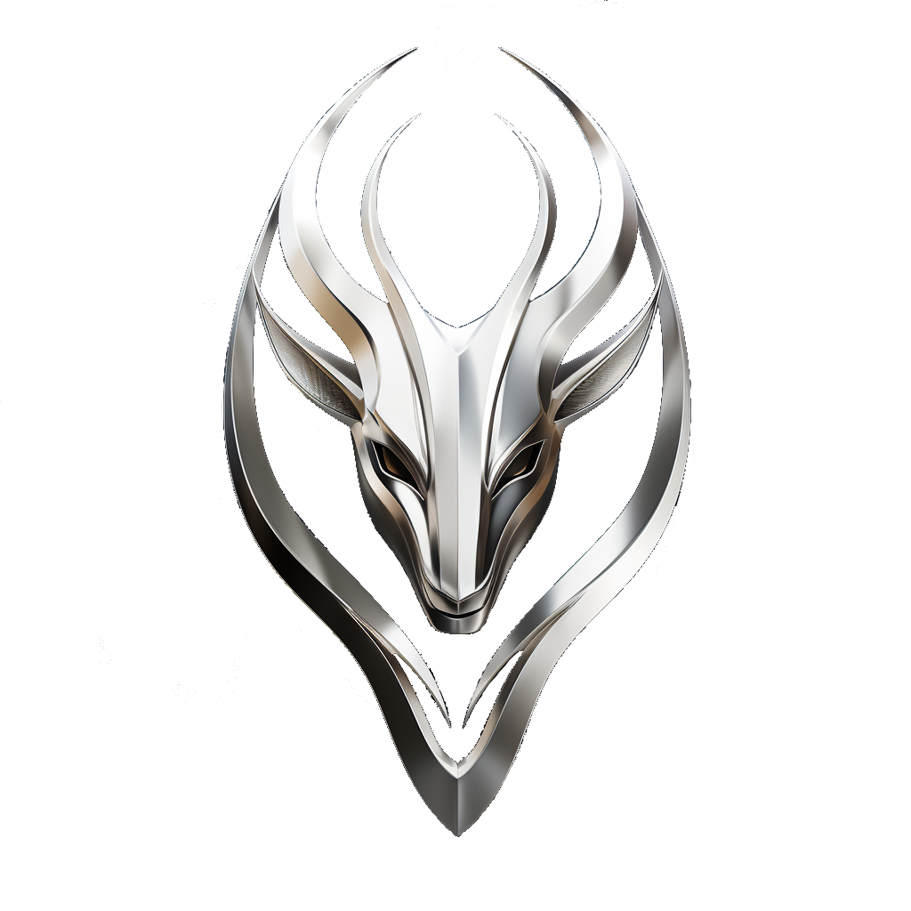
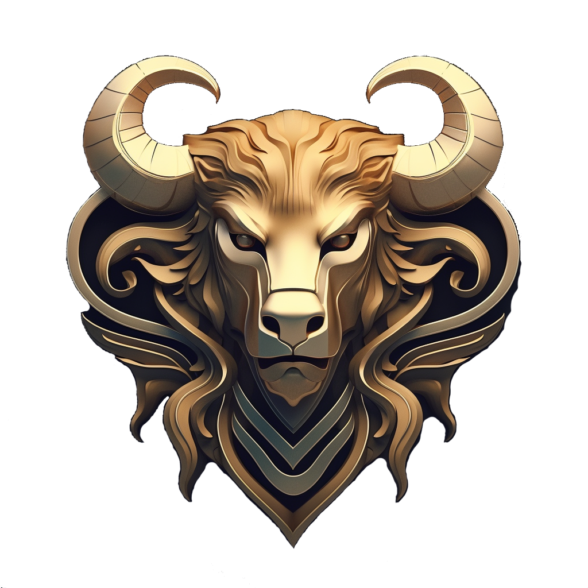
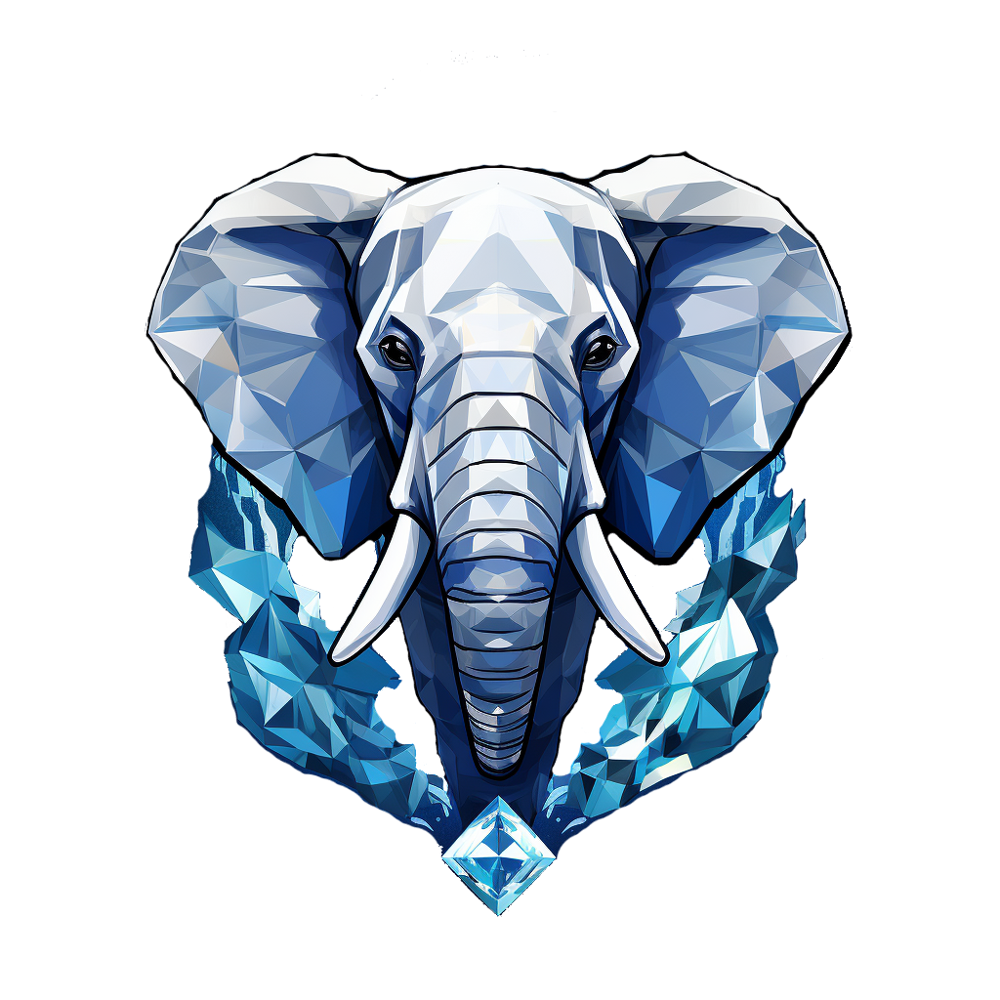

# DeXodus

---

DeXodus is the next generation decentralized perpetual exchange for everyone. 

Using a gas manager to pay for our users gas fees, users will no longer be subject to the variability of prices on chain congestion. We will instead establish a fair, estable fee for every transaction so that it proportionally impacts everyone’s performance in the same way. 

Also, we aim to incorporate a substantial amount of gamification features to improve user experience and make the protocol more accessible for everybody. For example, we have an NFT collection that has protocol-related benefits, such as fee yielding and fee reductions. These NFTs, when involved in a transaction can experience, level up, be combined and evolve, increasing their benefits along the way. We will also have rankings and seasonal leagues so that they can compete with other traders in the platform to see who has what it takes to make it to the very top.

Last but not least, from the very beginning, we have developed a subgraph so that users can easily query all transactions done on the website to set up their own open-source copy-trading strategy which eventually we will roll-out as an integrated feature of our application.

---
[Important Links](#important-links) •
[Project Overview](#project-overview) •
[Deployed Contracts](#deployed-contracts) •
[Tech Stack](#tech-stack) •
[Liquidity Pool](#liquidity-pool) •
[Perpetual Trading](#perpetual-trading) •
[NFT Gamification](#nft-gamification) 

---

## Important Links

- [MVP Website](https://dexodus-constellation.vercel.app/)

## Project Overview

Dexodus is a cutting-edge decentralized exchange protocol revolutionizing the DeFi landscape by combining a Perpetual Dex built on ZKSync with innovative gamification elements, trader leagues, and copy trading functionalities. Thus, enabling fee-less transactions and eliminating the need for users to hold ETH in their wallets.

One of our paramount objectives is to ensure a robust and secure trading environment. The protocol design is meticulously crafted to fortify against exploits, emphasizing stringent security measures at its core.

At Dexodus, we elevate the trading experience through innovative gamification elements. We understand the importance of user engagement, and our platform incorporates gamified features that enhance the overall trading experience. Through the integration of non-fungible tokens (NFTs), traders can actively participate in leagues, stake NFTs, and engage in copy trading without the traditional hurdles.

Our roadmap reflects our commitment to continuous improvement, emphasizing the empowerment of our community. Transparency, security, and user-centric design remain at the forefront of our priorities.

## Deployed Contracts

### Arbitrum Sepolia
|Contract                      |Address                                          |
|------------------------------|-------------------------------------------------|
|LiquidityPool                 |[0x1A01ED58476bE8dEc88686F0B237C8e0F1e87c8c](https://sepolia.arbiscan.io/address/0x1A01ED58476bE8dEc88686F0B237C8e0F1e87c8c)    |
|Futures                       |[0xFb3A9Bcf1d740C121C93984E19A7EF564410D89b](https://sepolia.arbiscan.io/address/0xFb3A9Bcf1d740C121C93984E19A7EF564410D89b)    |
|EXD                           |[0x37A183c6DB7BF2FCb9C40a5e2A9Ac0111e99b880](https://sepolia.arbiscan.io/address/0x37A183c6DB7BF2FCb9C40a5e2A9Ac0111e99b880)    |
|MockUSDC                      |[0xB4229AD6591dE49680704103E5Dc54585b2f2e5A](https://sepolia.arbiscan.io/address/0xB4229AD6591dE49680704103E5Dc54585b2f2e5A)    |
|Chest                         |[0x1C9Ab26901C59DF63369D069ba2780743bcCb3D6](https://sepolia.arbiscan.io/address/0x1C9Ab26901C59DF63369D069ba2780743bcCb3D6)    |
|Guardians                     |[0x0d267DdEBF7941F5688c6a9ccAF019eC07fcA349](https://sepolia.arbiscan.io/address/0x0d267DdEBF7941F5688c6a9ccAF019eC07fcA349)    |

## Tech Stack
At Dexodus, our innovative approach relies on a tailored tech stack, offering customized futures contracts for enhanced efficiency in gamification features and more. Here's an insight into our technology arsenal:

- Customized Futures Contracts: Engineered in-house to achieve tailored efficiency standards for gamification features and functionalities.
- Proprietary Liquidity Pool: Our internally-managed liquidity pool ensures efficient auto-compounding mechanisms.
- ZKSync Deployment: Leveraging ZK Rollups for swift, decentralized, and secure transactions on ZKSync. For futures functionality, users incur no transaction fees, thanks to paymasters utilizing account abstraction.
- TheGraph Integration: Facilitating automatic position liquidation, historical position access, powering trader tournaments, rankings, and copy trading.
- API3 and Chainlink Integration: Utilized for price feeds and randomization of NFTs, ensuring accuracy and reliability.
- IPFS + Filecoin: Employed for heightened decentralization and data persistence, enhancing the durability and distribution of our data storage infrastructure.
- This tech arsenal empowers Dexodus with cutting-edge functionalities, superior efficiency, and an unparalleled level of security and decentralization.

## Liquidity Pool
The liquidity pool in Dexodus allows users to contribute USDC tokens to the pool in exchange for LP (Liquidity Provider) tokens. For instance, a user adding 1,000 USDC might receive 10,000 LPX tokens, with each LPX token initially valued at 0.10 USDC.

As traders engage in transactions on the platform, statistics suggest that on average, they might incur losses. These losses ultimately contribute to filling the liquidity pool with additional USDC funds. Importantly, the USDC that flows into the liquidity pool becomes directly available for traders' use, facilitating the autocompounding of rewards for liquidity providers. This feature allows providers to passively generate returns without active engagement in the pool or the protocol.

When a liquidity provider decides to withdraw their USDC holdings, they can simply return the LP tokens. Notably, the LP tokens will have appreciated in value due to the accumulation of additional USDC and potential trading fees within the pool. The provider can actively monitor the fluctuation of LPX token prices in real-time on the frontend interface.

This functionality offers a straightforward yet powerful mechanism for liquidity providers to contribute to the pool, passively accumulate rewards through autocompounding, and withdraw their assets at an appreciated value, all while actively monitoring their investment.

## Perpetual Trading
Dexodus offers a groundbreaking approach to trading where users can engage in trading activities without the necessity of holding ETH in their wallets.

At present, the platform allows trading exclusively on BTC and ETH, with plans to introduce additional tokens in the future.
Currently, users can execute long positions, and the platform will soon support short positions as well.

Traders can interact with the futures contract to engage in perpetual trading activities. The following functionalities are currently enabled:
Open Position: Enables the initiation of a trading position.
Increase Position: Allows the augmentation of a position by adding more collateral and leverage.

Decrease Position (Keep Ratio): Permits the reduction of a position (or partial exit) while maintaining the collateral-to-leverage ratio.
Close Position: Allows the complete closure of a position, returning the entire leverage and settling any associated fees.

Future enhancements to the platform will include:
- Limit Orders: Introducing conditional orders where users can set long or short positions based on specific price levels and exit conditions.
- Increase Collateral: Capability to increase collateral for a specific position.
- Decrease Collateral: Capability to reduce the collateral associated with a position.

Dexodus aims to continually expand its functionalities, ensuring a comprehensive trading experience while prioritizing flexibility and user control over trading strategies.

## NFT Gamification
#### NFT Issuance
NFTs can be acquired by opening chests or purchasing them directly from the marketplace. Upon opening chests, NFTs are acquired randomly, each possessing distinctive properties:
- Evolution: NFTs have five evolution types, requiring four identical NFTs at maximum experience to evolve.
- Age: NFTs have varying ages, affecting the experience required to level up.
- Experience: Older NFTs require more experience to level up.
- Genetics: Genetics provide a boost to the yield generated and the power within the protocol. Rarity depends on the NFT's traits, determining its impact.

#### NFT Arena
The core gamification feature allows NFTs to be trained in the NFT Arena. Users can simultaneously have a bull and a bear in the NFT Arena. Successful long trades enhance the bull's experience, while successful short trades boost the bear's experience.

#### NFT Gaming
NFTs will eventually be usable in community-made mini-games to generate yields. Until the first mini-game is developed, leveled-up NFTs can be staked. NFTs have a weight, contributing to yield generation within the protocol.

## Staking: NFTs & EXD
Both NFTs and EXDs can be staked to earn yields and additional utilities within the Dexodus ecosystem.

Staking rewards will be derived from:
- Linear EXD Token Issuance: Stakers will receive yields through a linear token issuance of EXD.
- USDC from Generated Fees: Yield generation will be supplemented by a portion of fees collected, primarily from trading and borrowing fees.

Users participating in staking activities with their NFTs and EXDs will not only earn yields but also contribute to the overall liquidity and stability of the protocol, thereby enhancing the ecosystem's health and incentivizing long-term engagement.

## Leagues & Seasons

Within Dexodus, traders have the opportunity to compete in trader leagues during each season, which will last for a duration of two weeks. These leagues are divided into different divisions, each represented by different animals: rabbit, deer, buffalo, and elephant. Moving up from one league to another will require traders to be among the best from the previous season. The top traders from each league will receive monetary rewards at the end of each season, along with NFTs and chests.

Traders compete simultaneously in an absolute and relative ranking. The absolute ranking takes into account the absolute net PnL, that is, the total gains of the trader. Meanwhile, the relative ranking considers the PnL in relation to the size of the positions managed. This allows a trader to compete in a division, for example, in the rabbit division in the absolute ranking, but in the buffalo division in the relative ranking, due to the comparison of their profits with the size of their operations.

Traders will have the option to access a higher league by paying, but staying in that league will depend entirely on their performance.

Tier 1 - Hare (Bronze)

Tier 2 - Gazelle (Silver)

Tier 3 - Buffalo (Gold)

Tier 4 - Elephant (Diamond)

